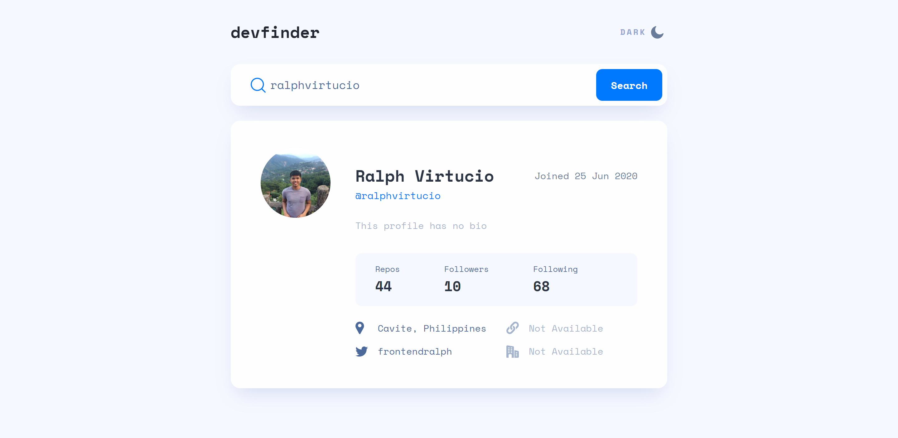

# Frontend Mentor - GitHub user search app solution

This is a solution to the [GitHub user search app challenge on Frontend Mentor](https://www.frontendmentor.io/challenges/github-user-search-app-Q09YOgaH6). Frontend Mentor challenges help you improve your coding skills by building realistic projects.

## Table of contents

- [Overview](#overview)
  - [The challenge](#the-challenge)
  - [Screenshot](#screenshot)
  - [Links](#links)
- [My process](#my-process)
  - [Built with](#built-with)
  - [What I learned](#what-i-learned)
  - [Continued development](#continued-development)
  - [Useful resources](#useful-resources)
- [Author](#author)

## Overview

### The challenge

Users should be able to:

- View the optimal layout for the app depending on their device's screen size
- See hover states for all interactive elements on the page
- Search for GitHub users by their username
- See relevant user information based on their search
- Switch between light and dark themes
- **Bonus**: Have the correct color scheme chosen for them based on their computer preferences. _Hint_: Research `prefers-color-scheme` in CSS.

### Screenshot

### Links

- Solution URL: [Solution Site](https://github.com/ralphvirtucio/github-search-user)
- Live Site URL: [Live Site](https://dashing-torte-737eaf.netlify.app/)

## My process

### Built with

- Semantic HTML5 markup
- CSS custom properties
- Flexbox
- CSS Grid
- Mobile-first workflow
- [React](https://reactjs.org/) - JS library

### What I learned

Doing this challenge, I learn how to implement a dark/light mode on a web application

### Continued development

One of the concept that I want to focus in my future projects is creating a theme mode, I'm targeting to to implement the bonus task for this project.

### Useful resources

- [Creating Theme Switcher](https://inclusive-components.design/a-theme-switcher/) - This link help me to create an accessible theme switcher which will help other user to use this web application.

- [Implementing Dark Mode in React with SASS](https://betterprogramming.pub/a-complete-guide-to-implementing-dark-mode-in-react-47af893b22eb) - This amazing article help me to implement the dark mode with React.js and SASS.

## Author

- Frontend Mentor - [@ralphvirucio](https://www.frontendmentor.io/profile/ralphvirucio)
- Twitter - [@frontendralph](https://www.twitter.com/frontendralph)
